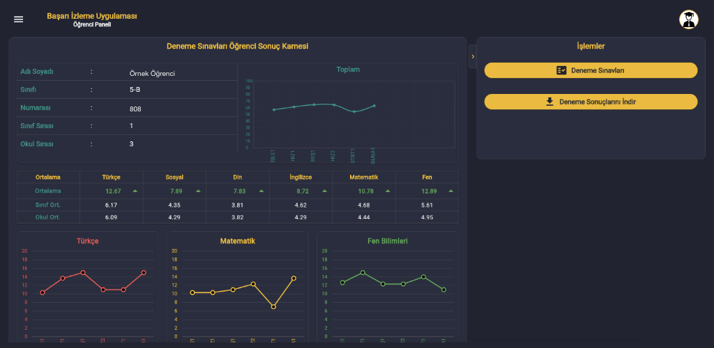

# Guidance

Rehberlik is an application designed to help students track their exam results, while providing teachers and parents with statistical analysis of their progress.

This application is built using the Firebase framework and Flutter.

## Packages Used and Their Descriptions

| Package Name            | Description                                       |
|-------------------------|---------------------------------------------------|
| [flutter_bloc](https://pub.dev/packages/flutter_bloc) | State management                    |
| [syncfusion_flutter_datagrid](https://pub.dev/packages/syncfusion_flutter_datagrid) | Advanced data tables and Excel outputs |
| [fl_chart](https://pub.dev/packages/fl_chart) | Student result charts                       |
| [auto_router](https://pub.dev/packages/auto_route) | Route management                    |
| [easy_localization](https://pub.dev/packages/easy_localization) | Localization management             |

## Application Screenshot

## Get Rehberlik on Google Play and YSOSINAV

Get Rehberlik on [Google Play](https://play.google.com/store/apps/details?id=com.gurcanataman.rehberlik) and [YSOSINAV](https://ysosinav.com.tr/) website.

Thank you for checking out our app!
